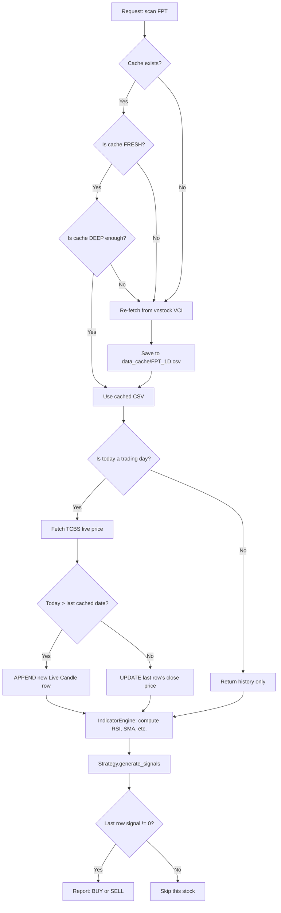

# Skill: Market Scanning

## When to Use This Skill

Activate this skill when the user requests any of the following:
- "Scan the market today", "What should I buy/sell?"
- "Does FPT have any signal right now?"
- "Why is the scanner showing no results?"
- "Run my strategies against VN30"
- "Is the data fresh? Is the live candle working?"

---

## Prerequisites

1. **TCBS Authentication** — The scanner requires a valid `StockAuth` token for live prices
2. **Strategy classes** must exist and be registered in `strategies/__init__.py`
3. **Internet connection** — Fetches live data from TCBS API + historical data from vnstock (VCI)

---

## Architecture Context

> **CRITICAL**: The AI assistant MUST understand this data flow before modifying any scanning logic.

### The Data Pipeline



### Key Concept: The "Live Candle"

This is the system's most unique feature:
- **Problem**: vnstock data is delayed (yesterday). TCBS data is real-time but has no history.
- **Solution**: Append the current TCBS price as a synthetic "live candle" to the historical DataFrame.
- **Result**: Indicators (RSI, SMA) calculate using the *exact price right now*.

### Freshness Logic

The system determines the "expected fresh date" intelligently:
- If today is a **trading day** AND it's **after 16:00** → expects today's data
- Otherwise → steps backward to find the last completed trading day
- Holidays are loaded from `config/holidays_vn.csv`
- Cache is marked stale if `last_cached_date < expected_fresh_date`

### File Map

| Component | Path | Purpose |
|:--|:--|:--|
| CLI entry point | `scripts/scan_market.py` | User-facing script with stock lists & strategies |
| Scanner engine | `core/market_scanner.py` | Core scanning logic, signal detection, result formatting |
| Data provider | `data_ingest/data_provider.py` | Cache management, vnstock fetch, TCBS live merge |
| Indicator engine | `core/indicator_engine.py` | Centralized pandas-ta computation |
| Auth module | `auth/auth.py` | TCBS token management |
| Cache directory | `data_ingest/data_cache/` | CSV files per stock (`FPT_1D.csv`) |
| Holiday calendar | `config/holidays_vn.csv` | Vietnamese market holidays |
| Stock lists | `scripts/scan_market.py` | `VN30` (30 stocks) and `stock_list` (100+ stocks) |

---

## Execution Steps

### Step 1: Choose Your Stock Universe

The script has two pre-built lists at the top of `scan_market.py`:
- `VN30` — 30 blue-chip stocks (fast scan, ~2 minutes)
- `stock_list` — 100+ stocks (thorough scan, ~6 minutes)

Override via command line:
```bash
# Scan only specific stocks
python3 -m trading_on_tcbs_api.stock_system_v2.scripts.scan_market FPT,HPG,TCB

# Scan full default list
python3 -m trading_on_tcbs_api.stock_system_v2.scripts.scan_market
```

### Step 2: Understand the Output

The scanner outputs **strategy-grouped DataFrames**:

```
--- Strategy: DipBuy (10.0%) ---
| date       | symbol | signal | price   | %_from_sma20 | rsi_14 |
|:-----------|:-------|:-------|:--------|:-------------|:-------|
| 2026-03-13 | HPG    | BUY    | 25,100  | -12.5        | 28.3   |
| 2026-03-13 | TCB    | BUY    | 23,800  | -8.7         | 31.2   |
```

Each table shows:
- **date**: The trading day the signal was detected
- **symbol**: Stock ticker
- **signal**: BUY or SELL
- **price**: Close price at detection time
- **Indicator columns**: Strategy-specific values (RSI, SMA distance, volume spike %, etc.)

### Step 3: Access Results in PyCharm SciView

When run from PyCharm, the script exports each strategy's DataFrame to a global variable:
```python
signals = main()
# Auto-exported as:
# df_dipbuy_10pct → DataFrame for DipBuy strategy
# df_volume_breakout_20 → DataFrame for Volume Breakout
# etc.
```

### Step 4: Cross-Reference with Backtest

After identifying a signal, verify its historical reliability:
```bash
# Check how profitable DipBuy has been on HPG historically
python3 -m trading_on_tcbs_api.stock_system_v2.scripts.backtest_market HPG

# Visualize exactly where past signals appeared
python3 -m trading_on_tcbs_api.stock_system_v2.scripts.visualize_trades HPG "DipBuy (10.0%)"
```

---

## Interpreting Scanner Results

### Signal Strength Indicators

| What to Check | Strong Signal | Weak Signal |
|:--|:--|:--|
| RSI value | < 25 (deeply oversold) | 28-30 (borderline) |
| `%_from_sma20` | > -15% (deep discount) | -5% to -10% (minor dip) |
| Volume spike | > 200% of 20-day avg | 120-150% (noisy) |
| Multiple strategies agree | 3+ strategies fire BUY | Only 1 strategy |

### When to Trust vs Ignore Signals

- **Trust**: Signal appears on a stock with historically positive backtest returns (check Table 2 forward returns)
- **Ignore**: Signal fires on a stock with < 40% backtest win rate
- **Investigate**: Signal fires with extreme indicator values (RSI < 15 could mean real trouble, not a buying opportunity)

---

## Troubleshooting

| Problem | Cause | Fix |
|:--|:--|:--|
| "Authentication failed" | TCBS token expired | Re-run auth flow; check `auth/auth.py` credentials |
| No signals found | Current market is calm / no extremes | This is normal — not every day produces signals |
| Stale data (yesterday's prices) | Cache not refreshed | Run with `force_update=True` or delete the cache CSV |
| "Error fetching realtime price" | TCBS API rate limit or downtime | Wait 1-2 minutes and retry |
| Scanner is very slow | Too many stocks + API rate limit (3s/request) | Use `VN30` instead of `stock_list` for faster scan |
| Live candle not appending | Weekend/holiday or market not open | Expected behavior — live candles only on trading days |
| Indicators showing NaN | Not enough historical data (new IPO) | Stock is too new; need minimum 50 days of data |

---

## Adding a New Stock List

To scan a custom set of stocks, add a new list to `scan_market.py`:

```python
# My watchlist
MY_WATCHLIST = ["FPT", "HPG", "TCB", "MWG", "VNM"]
```

Then set `symbols = MY_WATCHLIST` in the `main()` function, or pass via CLI:
```bash
python3 -m trading_on_tcbs_api.stock_system_v2.scripts.scan_market FPT,HPG,TCB,MWG,VNM
```

---

## Quick Reference: Scanner API

```python
from trading_on_tcbs_api.stock_system_v2.core.market_scanner import MarketScanner
from trading_on_tcbs_api.stock_system_v2.auth.auth import StockAuth

auth = StockAuth()
auth.validate()

scanner = MarketScanner(strategies=my_strategies, auth=auth)

# Method 1: Raw list of dicts
results = scanner.scan(["FPT", "HPG"])

# Method 2: Strategy-grouped DataFrames (preferred)
df_dict = scanner.scan_to_df(["FPT", "HPG"])
```
