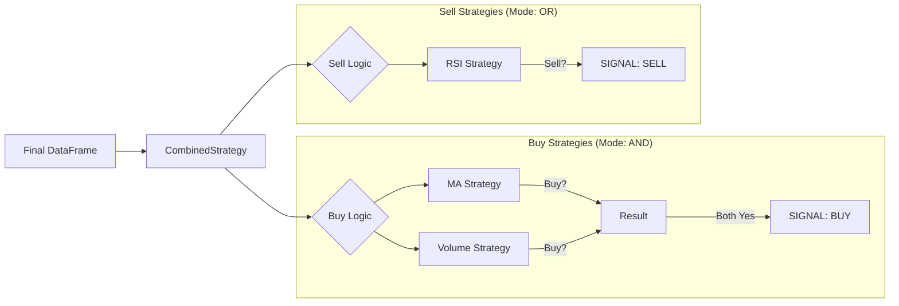

# System Architecture & Data Flow

This document explains how data moves through your trading system, from the external API to the buy/sell signal.

## 1. The Data Pipeline (`DataProvider`)
The **Heart** of the system. It ensures strategies always have "Live" data without hitting rate limits.

```mermaid
graph TD
    A[Request Data (e.g., HPG)] --> B{Check Cache?};
    B -- Yes --> C[Load data_cache/HPG_1D.csv];
    C --> D{Is Cache Fresh?};
    D -- No (Stale) --> E[Fetch vnstock (VCI)];
    D -- Yes --> F[Use Cached Data];
    B -- No --> E;
    E --> G[Save to Cache];
    G --> F;
    F --> H[Fetch TCBS Live Price];
    H --> I{Is Market Open?};
    I -- Yes --> J[Merge: History + Live Candle];
    I -- No --> K[Return History Only];
    J --> L[Final DataFrame];
```

**Key Concept: The "Live Candle"**
- **Problem**: `vnstock` data is delayed (yesterday). TCBS data is real-time (now) but has no history.
- **Solution**: We take the 365-day history from `vnstock` and **append** the current TCBS price as the latest row (the "Live Candle").
- **Result**: Your indicators (MA, RSI) calculate using the *exact price right now*.

## 2. The Logic Layer (`Strategy`)
Once we have the `Final DataFrame`, it goes into the Strategy Engine.



## 3. The Application Layer (How tools use it)

### A. The Scanner (`scan_market.py`)
1.  **Input**: List of Symbols (VN30).
2.  **Process**:
    *   For each symbol: Call `DataProvider` -> Get Data.
    *   Call `CombinedStrategy` -> Get Signals.
    *   Check **Today's** Signal.
3.  **Output**: A list of opportunities (e.g., "VIC: BUY").

### B. The Backtester (`backtest_market.py` & `verify_backtest.py`)
1.  **Input**: A Configured Strategy `+` A List of Symbols (e.g. VN30) `+` Timeframe (e.g. 1825 Days / 5 Years).
2.  **Process (Per Stock Loop)**:
    *   **Data Collection (The Timeline)**: The engine searches cache/API to construct a chronological daily data frame (Open, High, Low, Close, Volume) backward in time up to 5 years.
    *   **Mathematics (The Indicators)**: The engine (`IndicatorEngine`) applies all necessary mathematical transformations (`SMA`, `RSI`, `ROC`) upfront across the entire timeline prior to simulation.
    *   **The Simulation Loop (The Trading)**: The simulator initializes a virtual wallet (e.g., 1 Billion VND). It steps forward day-by-day:
        *   If the strategy generates `BUY (1)` -> It buys max possible shares at that day's `close` price and subtracts cash.
        *   If the strategy generates `SELL (-1)` -> It dumps 100% of held shares at the `close` price, calculates the PnL and trade duration, and adds revenue to cash.
    *   **Final Settlement**: If shares are held on the very last day of the simulation, they are artificially sold at the current market price to calculate accurate closing metrics.
3.  **Output (Aggregation)**: The core engine evaluates the portfolio lifecycle to extract **Win Rate**, **Maximum Drawdown (MDD)**, **Profit Factor**, and **Average Hold Time**. The CLI then aggregates the results of all stocks traded by that Strategy to output the final mathematical **Average Return %**.

### C. The Executor (`OrderManager`) *[Coming Soon]*
1.  **Input**: A Signal (BUY HPG).
2.  **Process**:
    *   Check `safe_mode`.
    *   If Safe: Print "MOCK BUY".
    *   If Real: Call TCBS API `/equity/order`.
